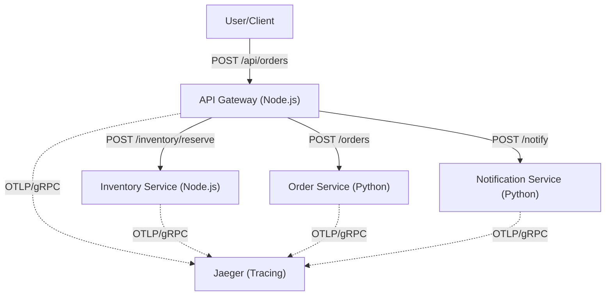

# Polyglot Microservices with Distributed Tracing

A production-ready microservices architecture demonstrating **Distributed Tracing** using **OpenTelemetry** and **Jaeger**. The system is built with a polyglot approach (Node.js and Python) and is fully containerized.

## 🏗️ Architecture

The application simulates an e-commerce order flow where a request traverses four distinct services.



### Services Breakdown

| Service                  | Language          | Description                                              | Instrumentation                             |
| :----------------------- | :---------------- | :------------------------------------------------------- | :------------------------------------------ |
| **API Gateway**          | Node.js (Express) | Entry point, orchestrates flows, propagates Trace ID.    | Auto-instrumentation (HTTP).                |
| **Inventory Service**    | Node.js (Express) | Checks and reserves stock. Marks errors if out of stock. | Auto-instrumentation + Custom Events.       |
| **Order Service**        | Python (FastAPI)  | Creates order records. Implementation of custom spans.   | Manual Span (`process_order`), Custom Tags. |
| **Notification Service** | Python (FastAPI)  | Sends confirmation emails (simulated).                   | Auto-instrumentation (FastAPI).             |

## 🚀 Getting Started

### Prerequisites

- [Docker Desktop](https://www.docker.com/products/docker-desktop/)
- [jq](https://stedolan.github.io/jq/) (for trace analysis script)

### Installation

1. Clone the repository.
2. Ensure you are in the project root.
3. Start the entire stack:
   ```bash
   docker-compose up -d --build
   ```

### Verification

Wait for all services to be healthy:

```bash
docker-compose ps
```

## 🛠️ Usage

### 1. Create a Successful Order

```bash
curl -X POST http://localhost:8080/api/orders \
  -H "Content-Type: application/json" \
  -d '{
    "userId": 1,
    "items": [{"sku": "SKU123", "quantity": 2, "price": 50.0}],
    "email": "customer@example.com"
  }'
```

**Response:** `201 Created` with `orderId` and `traceId`.

### 2. Simulate "Out of Stock" Error

```bash
curl -X POST http://localhost:8080/api/orders \
  -H "Content-Type: application/json" \
  -d '{
    "userId": 1,
    "items": [{"sku": "OUT-OF-STOCK", "quantity": 1, "price": 0.0}],
    "email": "customer@example.com"
  }'
```

**Response:** `400 Bad Request`. Check Jaeger for the error tag on the `inventory-service` span.

## 🔍 Observability

### Jaeger UI

Access the Jaeger dashboard at: [http://localhost:16686](http://localhost:16686)

### Trace Analysis Script

A helper script is provided to identify "slow" traces (e.g., traces exceeding 200ms):

```bash
chmod +x analyze-traces.sh
./analyze-traces.sh 200
```

## 📄 Project Structure

- `api-gateway/`: Node.js entry point and tracing configuration.
- `inventory-service/`: Node.js service for stock management.
- `order-service/`: Python service with custom span logic.
- `notification-service/`: Python service for notifications.
- `docker-compose.yml`: Main orchestration file.
- `analyze-traces.sh`: Trace analysis utility.
- `submission.json`: Metadata for evaluation.
- `.env.example`: Configuration template.
